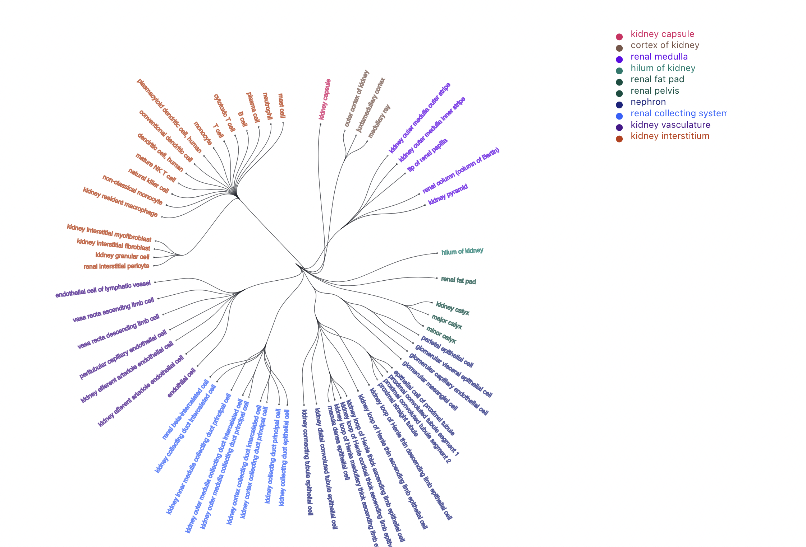
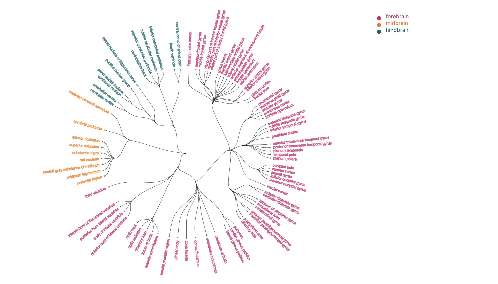

# Tree of Life - Human Anatomy

## Available Scripts

In the project directory, you can run:

### `npm start`

Runs the app in the development mode.\
Open [http://localhost:3000](http://localhost:3000) to view it in your browser.

The page will reload when you make changes.\
You may also see any lint errors in the console.

### `npm install`

Installs the necessary packages for the application. The packages can be viewed in node_modules folder.

### `preprocessing.py`
Takes the CSV in ASCTB v1.1 format as input to create a regular csv.

**Usage**
```{bash}
python3 preprocessing.py source_path dest_path
```

Example:
```{bash}
python3 preprocessor.py "./src/data/Kidney_v1.1.csv" "./src/data/KidneyRegular.csv"
```

Possible solutions (Did not have time to implement):

+ Use a third party JS library (Please let me know about a good data wrangling library in js, similar to pandas).
+ Deploy our Python code on our flask server, upload file for processing and then get the processed file back for the visualization.

## Data understanding

From the kidney data, my understanding of the data hierarchy is as follows:

+ Column AS/2 is the child of AS/1. Hence the data hierarchy can be seen as:
+ CT/1 -> AS/5 -> AS/4 -> AS/3 -> AS/2 -> AS/1
+ If AS/5 is empty, a link is created between AS/4 to CT/1.
+ If there are only values for AS/1 and AS/2, AS/2 value is treated as the leaf node.

I could only do some basic processing using D3.js, as far as I know, advanced handling of csv formats in js needed additional node packages / libraries.

I did try to process the data in a .txt format. However, parsing a string to csv using d3 caused a problem. A value in the cell contained a comma (Example: "dendritic cell, human" in the kidney data). This threw off the ordering of the columns and the hierarchy of the data.

## Implementation Details

Libraries used: React, D3
Node packages: d3, react-bootstrap, gh-pages

+ Read the flat format csv file (preprocessed).
+ Create a random color generator based on material design guidelines.
+ Assign a random color to each row based on a unique value from "AS/2/LABEL". I chose that column since coloring it with lower levels in the hierarchy would cause too many categories, which may confuse the user in my opinion.
+ Create a hierarchy based on the flat data by assigning child and parent IDs.
+ Use d3.stratify() method to convert the hierarchical data structure into a d3 - readable structure.
+ Visualize the data in a radial tree. Reference: https://medium.com/analytics-vidhya/creating-a-radial-tree-using-d3-js-for-javascript-be943e23b74e

## Results

On Kidney data:



On Brain data:


